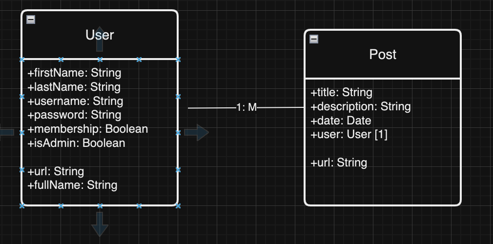

A small app that allows users to post content on a website. The app looks at authentication of users using a login/signup page and protected routes where only authorised admins are allowed to perform certain tasks like deleting posts. Users can also perform simple CRUD operations.

This was created using NodeJS, ExpressJS, and MongoDB.

